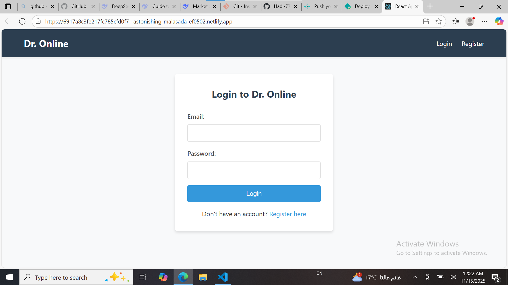
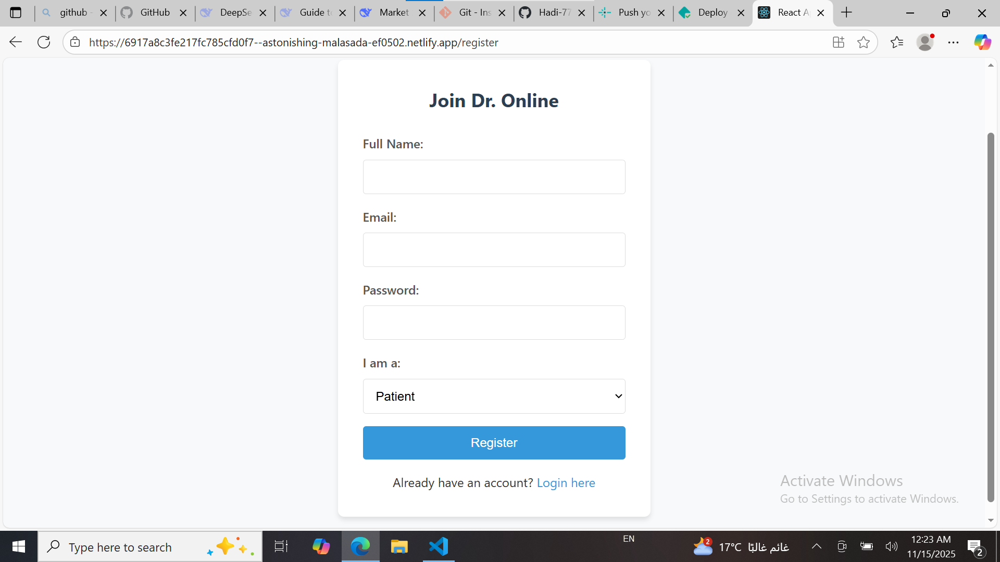
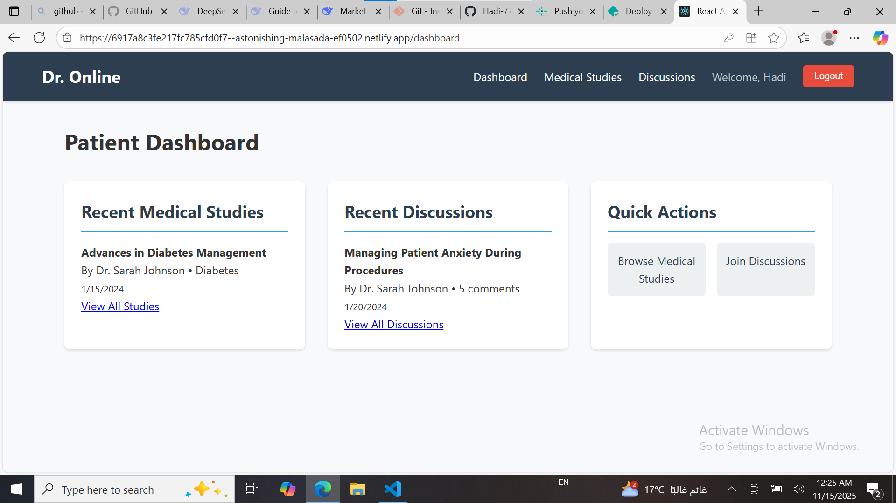
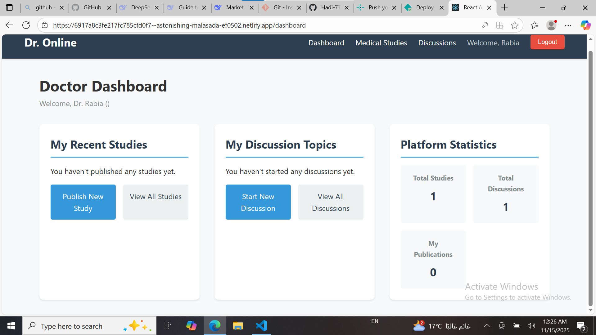
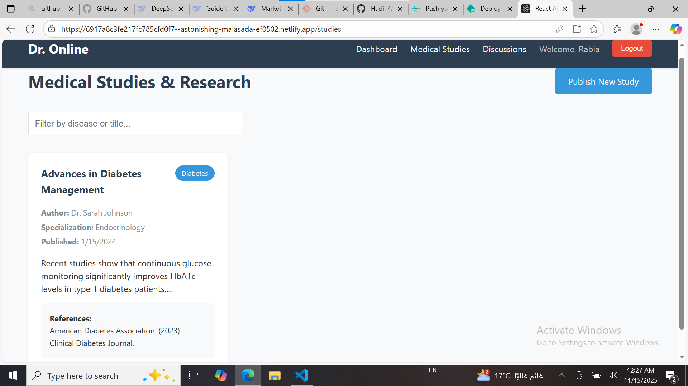
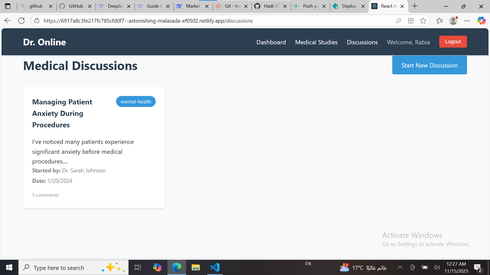

# Dr. Online - Medical Platform

A React.js web application connecting doctors and patients for medical discussions and updates.

## Features
- **Dual User System**: Patients & Doctors
- **Medical Studies**: Doctors can publish research
- **Discussion Forum**: Both can participate in medical discussions
- **Role-based Dashboards**: Different views for patients vs doctors

## Technologies Used
- **Frontend**: React.js, React Router, Context API
- **Styling**: CSS3, Responsive Design
- **State Management**: React Hooks
- **Authentication**: Custom Auth Context
- **Storage**: Browser Local Storage
- **Deployment**: Netlify

## Live Demo
🌐 **Live Application**: https://6917a8c3fe217fc785cfd0f7--astonishing-malasada-ef0502.netlify.app/

## Screenshots

### Login Page


### Registration Page


### Patient Dashboard


### Doctor Dashboard  


### Medical Studies


### Discussions Forum



## Setup Instructions
```bash
git clone https://github.com/Hadi-777/dr-online.git
cd dr-online
npm install
npm start


